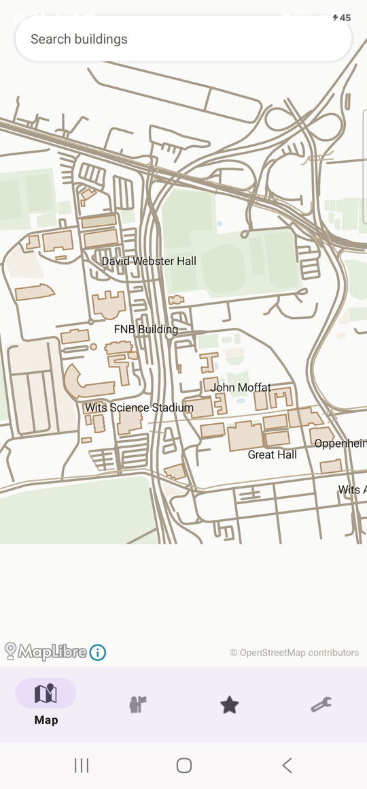
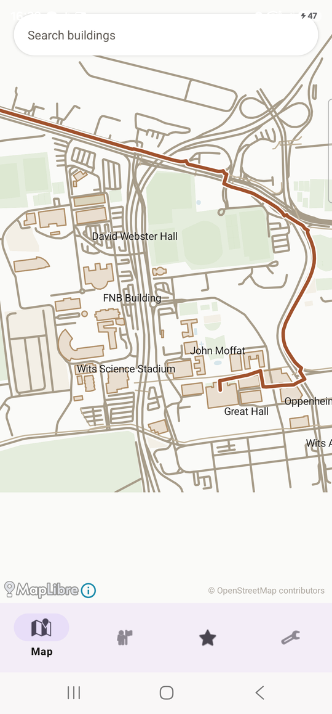
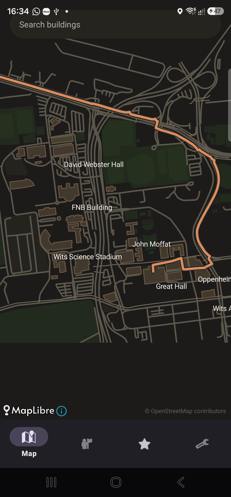
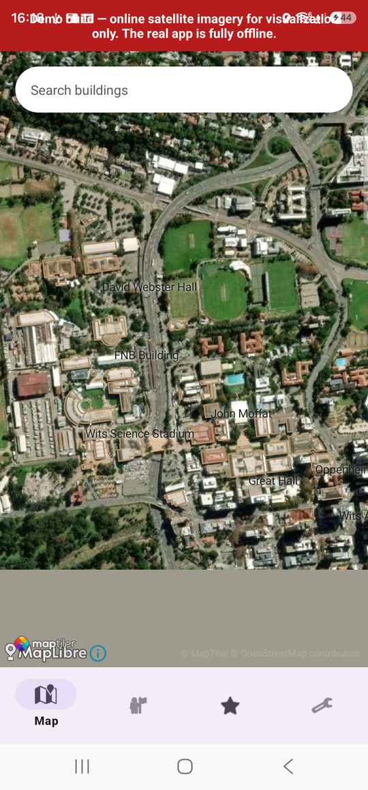

# Campus Navigator

An offline-first Android app for finding your way around Wits University — search for a building, get real walking directions, and never need a signal to do it.

<p align="center">
  
  
  
  
</p>

## What it does

- **Fully offline map** — a real, pannable/zoomable vector map of Wits campus, building outlines and labels included, with zero network dependency for any core function.
- **Live GPS position**, with an honest degraded-accuracy state and a clean fallback if location permission is denied.
- **Search** by building name, code, or code+room ("FNB101"), with fuzzy matching and an inferred floor estimate from the room number — never a bare "no results."
- **Turn-by-turn-capable walking routes**, computed entirely on-device by a custom A\* router over a real walkway graph, with live recompute as you walk.
- **Accessible routing** — stairs are modeled as genuinely impassable edges, not just "costly," so "avoid stairs" actually means avoid stairs, with an honest "no accessible route" message if none exists.
- **Common Picks** — curated landmarks and "nearest X" category picks (bathroom, ATM, cafeteria), resolved by real walking distance, not a straight line.
- **Favourites and Dark Mode**, both persisted, both applied consistently across every screen.
- A second, clearly-separated **demo build** with live satellite imagery, for visual pitching — see [below](#the-demo-flavor).

## Why this is more than a CRUD app

- **No routing library.** `:navigation-engine` is a from-scratch A\* implementation over a real walkway graph, sourced from actual OpenStreetMap data for the Wits campus footprint (not a hand-waved demo dataset).
- **No DI framework.** Dependency injection is a single manual composition root in `:app` — a deliberate choice to keep the object graph legible without Hilt/Dagger.
- **Every failure state is honest.** No route available says so. No accessible route says so. A building with no photo just omits the photo section — never a broken placeholder. This is a design principle threaded through the whole codebase, not a one-off.
- **Real data, not fixtures.** The bundled campus database was built from an actual Overpass API extraction of OpenStreetMap data for Wits, then hand-corrected and extended — including catching and fixing a real pre-existing bug where one building's outline was silently mismatched to a completely different building ~500m away.

## A few engineering war stories

**MapLibre went 0-for-3 on runtime-added map layers.** Text labels (`SymbolLayer`), the walking route (`LineLayer`), and building footprint fills (`FillLayer`) all silently failed to render against this app's minimal offline style — no crash, no error, nothing in logcat, just nothing on screen. Each time, the fix was the same: confirm the failure with a deliberate on-device test (not just an assumption), then fall back to drawing it as a native `Canvas`-rendered `View` overlaid on the map instead of a MapLibre layer. All three — labels, routes, and building fills — now render this way.

**A data bug hiding in plain sight.** While cross-referencing building names against the raw OpenStreetMap extract, I found that "Origins Centre" — a real museum on campus — had been silently matched to the wrong OpenStreetMap way during the original data import. Its rendered outline was actually a *different building* (a shopping center) 500 metres away. The bug had shipped and gone unnoticed until an unrelated task required re-checking the raw data directly instead of trusting an old comment.

**A tile size mismatch that looked like a licensing problem.** The satellite demo build's imagery silently failed to render after wiring up a real API key — tiles were fetching successfully (HTTP 200), but nothing painted. Turned out the style declared 256px tiles while the provider was actually serving 512px ones. One line fixed it, but finding it meant downloading and inspecting a raw tile's actual pixel dimensions rather than assuming the config was right.

**Manual campus mapping, closing a real data gap.** OpenStreetMap's coverage of Wits' *internal* footpaths turned out to be thin — 178 tagged buildings but only 40 walkway segments for the whole campus, which meant some computed routes cut through buildings that simply weren't in the graph. Rather than accept that, I built a small pipeline (`tools/osm/convert_manual_mapping.py`) that takes hand-traced paths and building outlines (drawn over satellite imagery in a free browser tool) and merges them into the routing graph — snapping new points onto the existing network within a few metres, deduplicating already-mapped segments, and supporting both brand-new buildings and corrections to existing ones.

## Architecture

```
:app                the composition root — manual DI, wires every feature together
:ui                 Fragments, ViewModels, custom Views (native map overlays)
:domain             use cases, the Result<T> type, repository interfaces — no Android dependency
:data                Room (two databases: bundled read-only campus data, and user data)
:navigation-engine   pure-Java A* router — zero Android dependency, zero :domain dependency
```

The dependency direction is deliberate: `:navigation-engine` doesn't know `:domain` exists, so the pathfinding core is testable and reusable on its own. `:domain` never sees a Room entity or an Android type — every use case returns a closed `Result<T>` (`Success` / `Error` / `NotFound`), so expected failures are values, not exceptions.

Two separate Room databases: a bundled, read-only campus database (buildings, walkway graph, footprints) shipped inside the APK with no first-run import step, and a small user-data database (favourites, settings) with its own independent migration path.

## Tech stack

Java 17 · Android (minSdk 23, target 36) · [MapLibre Native](https://github.com/maplibre/maplibre-native) for offline vector map rendering · Room 2.8.4 · AndroidX ViewModel/LiveData · Gradle multi-module · manual dependency injection, no DI framework

## Getting started

```bash
git clone <this-repo>
cd campus-navigator
./gradlew :app:assembleProductionDebug   # the real, fully-offline app
```

Install the APK from `app/build/outputs/apk/production/debug/`, or open the project in Android Studio and run the `production` build variant.

### The demo flavor

A second build variant (`demo`) swaps the offline vector basemap for live satellite imagery via [MapTiler](https://www.maptiler.com/), purely for visual demonstration — it's explicitly online, carries an unmissable on-screen banner saying so, and never touches the production flavor's code path. To build it:

1. Get a free API key from [MapTiler](https://www.maptiler.com/).
2. Create `local.properties` in the repo root (already gitignored) and add:
   ```
   MAPTILER_API_KEY=your_key_here
   ```
3. `./gradlew :app:assembleDemoDebug`

Both flavors install side by side on the same device (distinct application IDs) for easy comparison.

## Development process

This project was built using a structured, epic-and-story workflow with an adversarial multi-pass code review (three independent review lenses — defect-hunting, edge-case analysis, and acceptance-criteria auditing) run against every story before it was considered done. `deferred-work.md` and each story's own review-findings log every deliberate scope decision and known limitation, rather than leaving them undocumented. The result is a codebase where almost every non-obvious decision — including the ones that turned out to be wrong and got caught later — has a paper trail explaining why.

## License

MIT — see [LICENSE](LICENSE).
